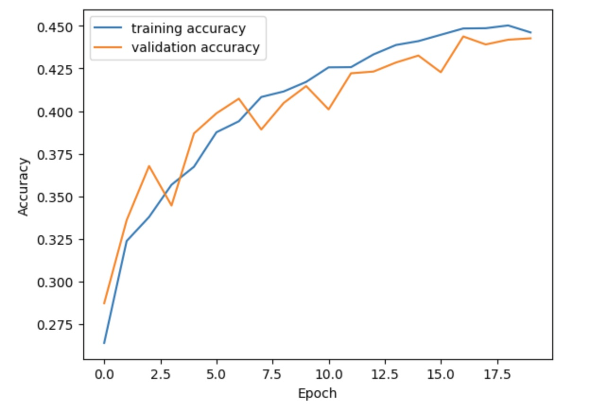
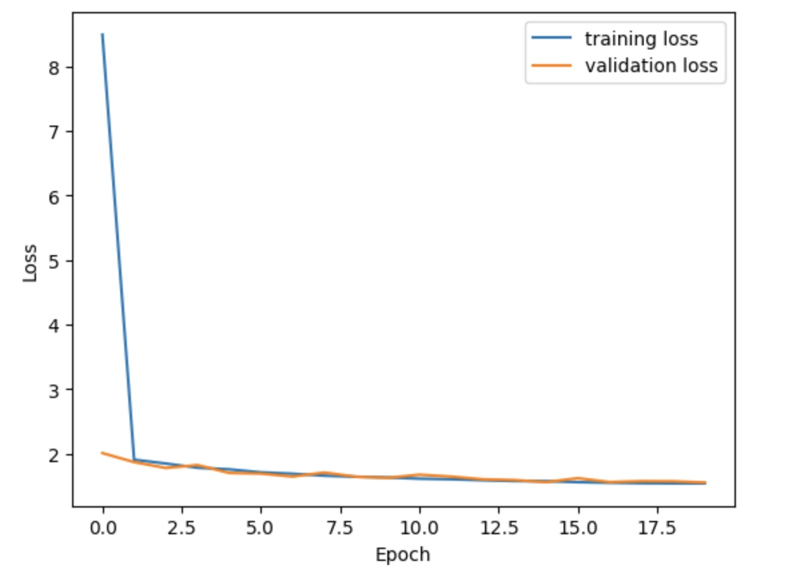
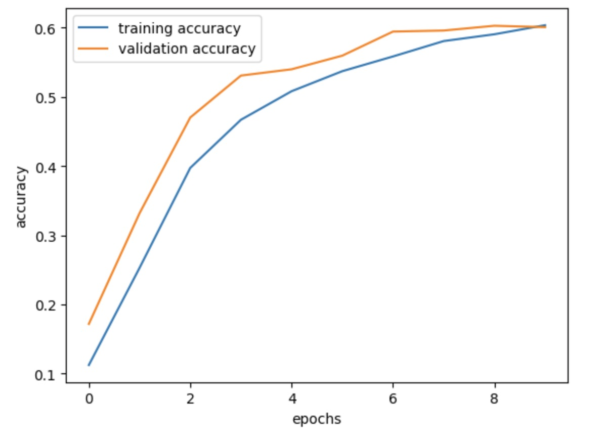
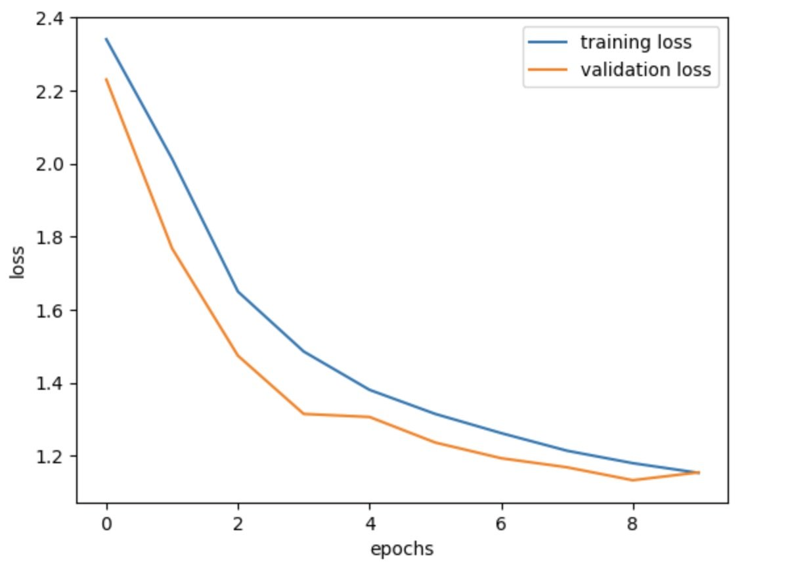

# CIFAR-10 Image Classification

CIFAR-10 is a dataset of 50,000 32x32 colored training images and 10,000 test images, labeled with 10 categories.

In the project, I have performed image classification on the CIFAR-10 dataset using

1. Deep Neural Network without Convolutional Layer
2. Deep Neural Network with Convolutional Layer

## Motivation:

To compare the above 2 approaches based on spped of convergence and accuracy.

## Results obtained with DNN

The final accuracy we achieve is 0.44.

As DNN is not typically designed for processing data with spatial relationships, it performs poorly when used on image classification. The training and validation curves follow a realtively close fit.

We see that the training and validation loss also follow a close fit. As the two curves are closely hugging each other, we can conclude that it is a good fit.

The criteria upon which we decide if a fit is good or bad is as follows:

a. The plot of training loss decreases to a point of stability.

b. The plot of validation loss decreases to a point of stability and has a small gap with the training loss.

## Results obtained with DNN+CNN

We see that the model performs poorly on the training data. However, there is significant improvement in the test results. This implies that our model does not overfit the data. Although for a closely hugging fit, we still need to tamper with the convolutional layers of the model and increase the number of epochs. As this is a computationally expensive procedure, I have limited it to a standard convolutional network. The accuracy we have achieved is: 0.60

We have achieved a decent loss as well. For the plot of training loss to decrease to a point of stability we must increase the number of epochs. Also the gap between the two curves is minimized at epoch 8. Hence, we can conclude that we have a resonably good fit for the number of epochs that our model has been trained on.

## Comparison of the 2 methods

### Comparison of Convergence Speed:

To compare the the convergence speeds, let us consider a threshold epoch of 1. At epoch = 1, the DNN (w/o CNN) classifier’s training loss curve is at a loss = 2 and over the successive epochs, drops to a minimum of approximately 1.8.

The training loss curve of the CNN (DNN with CNN) classifier is approximately 1.8 and over the successive epochs drops to a minimum of 1.2.

We see that the steeper descent after the threshold is observed in the CNN whereas in the DNN it mostly remains flat. The steeper decrease in loss signifies faster convergence. Hence we can say that the CNN classifier converges faster.

### Comparison of Accuracy:

The CNN (DNN with CNN) has a much better validation/test accuracy compared to the DNN classifier. This is beacuse, the CNN is designed to account for spatial relationship in the data and hence, it outperforms the DNN when classifying images.

The accuracy achieved with both the models is summarised below:

DNN w/o CNN: 0.44
DNN with CNN: 0.60
